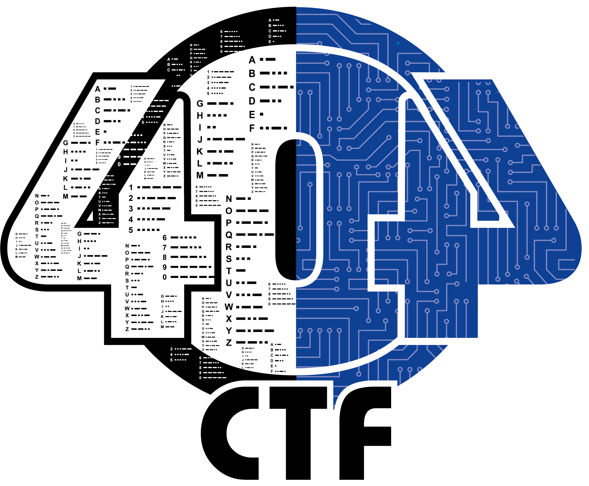
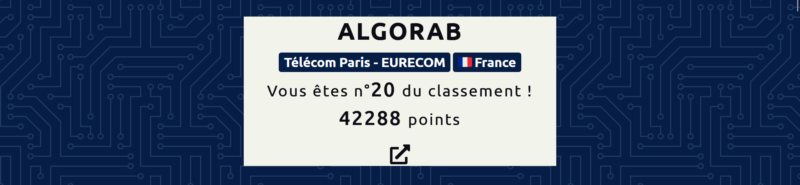

# 404CTF - 2022
### Télécom SudParis x DGSE

  

Voici mes write-ups de ce CTF, merci à l'organisation !

* #### Forensic
    * [Floppy](/forensic/floppy)
    * [Ping-Pong](/forensic/ping-pong) 
    * [Agent Compromis (1/3)](/forensic/compromis-1) 
    * [Agent Compromis (2/3)](/forensic/compromis-2)
    * [Agent Compromis (3/3)](/forensic/compromis-3)
    * [SOS-Raid (2/2)](/forensic/raid-2)
    * [Hackllebarde Ransomware (1/4)](/forensic/hackllebarde-1)
    * [Hackllebarde Ransomware (3/4)](/forensic/hackllebarde-3)   
* #### Stéganographie
    * [PNG : Un logo obèse (1/4)](/stegano/png-1)
    * [Stéréographie](/stegano/stereo)
    * [PNG : Drôles de chimères (2/4)](/stegano/png-2)
    * [PNG : Toujours obèse (3/4)](/stegano/png-3)
    * [La Méthode Française](/stegano/methode-francaise)
    * [PNG : Une histoire de filtres (4/4)](/stegano/png-4)
* #### Web
    * [Fiché JS](/web/js)
    * [Le Braquage](/web/braquage)
    * [Du Gâteau](/web/gateau)
    * [En Construction](/web/construction)
* #### Cryptanalyse
    * [Un simple oracle (1/2)](/crypto/oracle-1)
    * [Un simple oracle (2/2)](/crypto/oracle-2)
    * [Weak Signature](/crypto/weak)
    * [La fonte des hashs](/crypto/hash)
    * [Hackllebarde Ransomware (4/4)](/forensic/hackllebarde-4)
* #### Programmation
    * [Découpé](/prog/decoupe)
    * [128code128](/prog/128code128)
* #### Exploitation de binaires
    * [Trop facile](/pwn/facile)
    * [Sans Protection](/pwn/sans-protection)
    * [Cache-cache](/pwn/cache-cache)
* #### Web3
    * [Pense-bête](/web3/pense-bete)
    * [La Guerre des Contrats (1/2)](/web3/contrat-1)
    * [Clé Publique](/web3/cle-publique)
* #### Divers
    * [Pierre-Papier-Hallebarde](/divers/pph)
    * [Par Câble](/divers/cable)
    * [GoGOLFPlex](/divers/gogolfplex)
    * [Un Utilisateur Suspicieux (1/2)](/divers/bot-1)
    * [Un Utilisateur Suspicieux (2/2)](/divers/bot-2)

  

